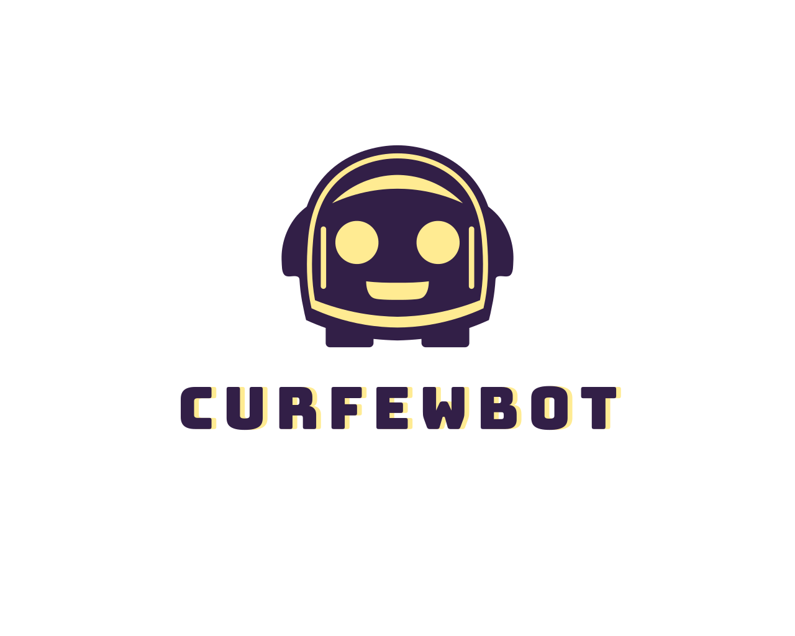

<!-- Improved compatibility of back to top link: See: https://github.com/othneildrew/Best-README-Template/pull/73 -->
<a name="readme-top"></a>
<!--
*** Thanks for checking out the Best-README-Template. If you have a suggestion
*** that would make this better, please fork the repo and create a pull request
*** or simply open an issue with the tag "enhancement".
*** Don't forget to give the project a star!
*** Thanks again! Now go create something AMAZING! :D
-->


<!-- PROJECT SHIELDS -->
<!--
*** I'm using markdown "reference style" links for readability.
*** Reference links are enclosed in brackets [ ] instead of parentheses ( ).
*** See the bottom of this document for the declaration of the reference variables
*** for contributors-url, forks-url, etc. This is an optional, concise syntax you may use.
*** https://www.markdownguide.org/basic-syntax/#reference-style-links
-->


<!-- PROJECT LOGO -->
<br />
<div align="center">
  <a href="https://github.com/derekn4/CurfewBot">
    
  </a>

<h3 align="center">CurfewBot: The Solution to Chronic Late Night Gamers</h3>

  <p align="center">
    This is exactly what it sounds like. It's a Discord bot that forces a curfew on members in your Discord group.
    The bot removes a user from any (and every) voice channel at a specified time and will not allow them to rejoin until their curfew is up.
    <br />
    <a href="https://github.com/derekn4/CurfewBot"><strong>Explore the docs »</strong></a>
    <br />
    <br />
    <a href="https://github.com/derekn4/CurfewBot">View Demo</a>
    ·
    <a href="https://github.com/derekn4/CurfewBot/issues">Report Bug</a>
    ·
    <a href="https://github.com/derekn4/CurfewBot/issues">Request Feature</a>
  </p>
</div>


<!-- TABLE OF CONTENTS -->
<details>
  <summary>Table of Contents</summary>
  <ol>
    <li>
      <a href="#about-the-project">About The Project</a>
      <ul>
        <li><a href="#built-with">Built With</a></li>
      </ul>
    </li>
    <li>
      <a href="#getting-started">Getting Started</a>
      <ul>
        <li><a href="#prerequisites">Prerequisites</a></li>
        <li><a href="#installation">Installation</a></li>
      </ul>
    </li>
    <li><a href="#usage">Usage</a></li>
    <li><a href="#roadmap">Roadmap</a></li>
    <li><a href="#contributing">Contributing</a></li>
    <li><a href="#contact">Contact</a></li>
    <li><a href="#acknowledgments">Acknowledgments</a></li>
  </ol>
</details>


<!-- ABOUT THE PROJECT -->
## About The Project

This is exactly what it sounds like. It's a Discord bot that forces a curfew on members in your Discord group.
The bot removes a user from any (and every) voice channel at a specified time and will not allow them to rejoin until their curfew is up.

<p align="right">(<a href="#readme-top">back to top</a>)</p>


### Built With

* [![Python][Python.org]][Python-url]

<p align="right">(<a href="#readme-top">back to top</a>)</p>


<!-- GETTING STARTED -->
## Getting Started

Since it's all in Python, we are going to need pip.

### Prerequisites

This is an example of how to list things you need to use the software and how to install them.
* pip
  ```sh
  pip install --upgrade pip
  ```

### Installation

1. To get started with the Discord API [https://discord.com/developers/docs/intro](https://discord.com/developers/docs/intro)
2. Clone the repo
   ```sh
   git clone https://github.com/derekn4/CurfewBot.git
   ```
3. Install Python packages
   ```sh
   pip install -r /path/to/requirements.txt
   ```
4. Enter your API in `.env`
   ```js
   BOT_TOKEN="YOUR BOT TOKEN HERE"
   ```

<p align="right">(<a href="#readme-top">back to top</a>)</p>


<!-- USAGE EXAMPLES -->
## Usage

First, make sure that your Bot is enabled for the Discord server of intended use.
Second, enable access to voice chat and text chats, as well as admin privileges. 

Command to set a curfew:
  - !curfew [time][AM/PM] [username]


<p align="right">(<a href="#readme-top">back to top</a>)</p>


<!-- ROADMAP -->
## Roadmap

- [X] Responds to command
- [X] Adds user to database with cutoff time
- [X] Kicks user out of voice call
    - [X] Continues to kick user out of voice channels until curfew is up
    - [X] Mentions and shames user in General chat if they try to join before curfew is over
- [ ] Push CurfewBot to server to run remotely and not local.

See the [open issues](https://github.com/derekn4/CurfewBot/issues) for a full list of proposed features (and known issues).

<p align="right">(<a href="#readme-top">back to top</a>)</p>


<!-- CONTRIBUTING -->
## Contributing

Contributions are what make the open source community such an amazing place to learn, inspire, and create. Any contributions you make are **greatly appreciated**.

If you have a suggestion that would make this better, please fork the repo and create a pull request. You can also simply open an issue with the tag "enhancement".
Don't forget to give the project a star! Thanks again!

1. Fork the Project
2. Create your Feature Branch (`git checkout -b feature/AmazingFeature`)
3. Commit your Changes (`git commit -m 'Add some AmazingFeature'`)
4. Push to the Branch (`git push origin feature/AmazingFeature`)
5. Open a Pull Request

<p align="right">(<a href="#readme-top">back to top</a>)</p>


<!-- CONTACT -->
## Contact

Derek Nguyen 
- [LinkedIn](https://www.linkedin.com/in/derekhuynguyen/) 
- [Email](derek.nguyen99@gmail.com)
<br></br>
Project Link: [https://github.com/derekn4/CurfewBot](https://github.com/derekn4/CurfewBot)

<p align="right">(<a href="#readme-top">back to top</a>)</p>


<!-- MARKDOWN LINKS & IMAGES -->
<!-- https://www.markdownguide.org/basic-syntax/#reference-style-links -->
[Python.org]: https://www.python.org/static/img/python-logo.png
[Python-url]: https://www.python.org/about/website/